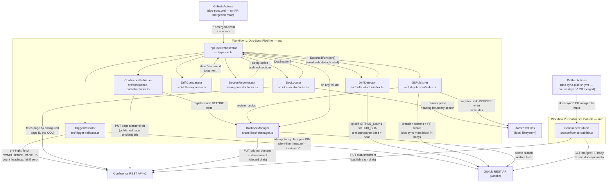

# Architecture: Automated Documentation Sync Pipeline

**Phase:** 2 — Architecture
**Date:** 2026-08-20
**Status:** Revised — awaiting design re-review

Requirement traceability: every design decision references the FR/NFR that
drives it. "Not Found" flags appear where a decision requires clarification
before implementation begins.

---

## Revision Log

The following findings from `docs/design-review.md` were resolved in this
revision. Product-owner decisions for F-1 and F-2 were provided explicitly;
all other resolutions follow the reviewer's recommended approach.

| Finding | Severity | One-line Resolution |
|---|---|---|
| F-1 | Critical | Pipeline now writes Confluence content as an unpublished draft only; a separate second GitHub Actions workflow (`doc-sync-publish.yml`) publishes each draft when the doc-sync PR is merged to `main`. |
| F-2 | Critical | Replaced CQL/title-filter search with direct page fetch using `CONFLUENCE_PAGE_ID` env var (`32833537`) or `docs/confluence-map.json`; scans page body for heading elements matching the function name; no CQL or title-search queries. |
| F-3 | Major | `SectionRegenerator` now uses remark only to locate section boundaries (character offsets), then performs raw-string splice; `remark-stringify` is never called on unchanged regions. |
| F-4 | Major | `DriftDetector` now uses `git diff GITHUB_SHA^1 GITHUB_SHA -- 'src/**/*.ts'`; workflow YAML declares `fetch-depth: 0` in the checkout step. |
| F-5 | Major | `TriggerValidator` first fetches open PRs and filters client-side to those with `head.ref` starting with `docs/sync-`; only that small set is inspected for the `Triggered-by:` sentinel body string. |
| F-6 | Major | Each `RollbackEntry` closure is pushed onto the stack immediately before the corresponding mutation; the register-then-mutate invariant is now explicit in Sections 4 (Step 8) and 5.8. |
| F-7 | Major | `TriggerValidator` runs a pre-flight Confluence parse validation before any mutation: fetches the configured page, counts heading elements, and exits non-zero with `CONFLUENCE_PARSE_VALIDATION_FAILED` if zero headings are found in a non-empty page body. |
| F-8 | Minor | Added rollback entry for `DOCS_DEFAULT_FILE` creation to Table 8.2; undo is `fs.unlink` registered before the file is created. |
| F-9 | Minor | `DriftDetector` deduplicates exported function entries by name; the last declaration (implementation signature) is canonical; noted in Section 5.3 and the `ExportedFunction` interface. |
| F-10 | Minor | Added `timeout-minutes: 5` to the workflow job; added `CONFLUENCE_REQUEST_TIMEOUT_MS` and `GITHUB_REQUEST_TIMEOUT_MS` env vars (default 30 000 ms each) applied to all external API calls. |
| F-11 | Minor | Added `eslint-plugin-jsdoc` with the `require-jsdoc` rule for all exported functions in `src/**/*.ts`; runs as part of `npm run lint` in CI. |
| F-12 | Minor | `redactSecrets` is now applied to all strings written to stdout, including structured error JSON fields; full regex pattern inventory defined in Section 8.5. |

---

## 1. Context

The pipeline lives inside a single GitHub repository and executes as one of
two GitHub Actions workflows:

- **`doc-sync.yml`** — fires on a PR merged to `main`; runs the full pipeline,
  writes Confluence content as unpublished **drafts** only, and opens a
  `docs/sync-*` PR with the Markdown changes and the Confluence draft page IDs
  embedded in the PR body.
- **`doc-sync-publish.yml`** — fires when a `docs/sync-*` PR is itself merged
  to `main`; reads Confluence page IDs from the merged PR body and publishes
  each draft (satisfying NFR-7's "before publishing, human review" gate).

Both workflows have read/write access to:

- **GitHub** — the source repository (read changed TypeScript, create branch,
  open PR, read merged PR body)
- **Confluence Cloud** — the external documentation platform (read pages,
  write unpublished drafts, publish drafts on PR merge)
- **Local `docs/*.md` files** — Markdown files tracked in the same repository

There are no other external systems. Each workflow is a self-contained
TypeScript Node.js process; neither is an interactive AI agent session.

```
┌──────────────────────────────────────────────────────────────────────────┐
│  Workflow 1: doc-sync.yml  (triggered: PR merged to main)                │
│                                                                          │
│   ┌──────────────────────────────────────────────────────────────────┐   │
│   │                  Doc-Sync Pipeline  (Node.js)                    │   │
│   │                                                                  │   │
│   │  TriggerValidator → DriftDetector → DocLocator                  │   │
│   │       → DriftComparator → SectionRegenerator                    │   │
│   │       → ConfluencePublisher (DRAFT only, never publishes live)   │   │
│   │       → GitPublisher                                             │   │
│   │       ↕  RollbackManager (cross-cutting)                         │   │
│   └──────────────────────────────────────────────────────────────────┘   │
│          │                         │                  │                  │
└──────────┼─────────────────────────┼──────────────────┼──────────────────┘
           ↓                         ↓                  ↓
    ┌─────────────┐      ┌──────────────────┐     ┌────────────┐
    │   GitHub    │      │ Confluence Cloud  │     │  docs/*.md │
    │  REST API   │      │   REST API v2     │     │ (git repo) │
    └─────────────┘      └──────────────────┘     └────────────┘
           ↑                         ↑
┌──────────┼─────────────────────────┼──────────────────────────────────────┐
│  Workflow 2: doc-sync-publish.yml  (triggered: docs/sync-* PR merged)    │
│                                                                           │
│   ┌──────────────────────────────────────────┐                           │
│   │  ConfluencePublish  (src/confluence-      │                           │
│   │  publish.ts)                              │                           │
│   │  • Parses doc-sync-meta block from PR body│                           │
│   │  • For each page ID: publishes draft      │                           │
│   └──────────────────────────────────────────┘                           │
└───────────────────────────────────────────────────────────────────────────┘
```

---

## 2. Alternative Approaches Considered

### Alternative A — Monolithic Script

A single `src/pipeline.ts` file that runs all steps sequentially with no
internal module boundaries.

**Rejected because:**
- No seam for unit testing individual concerns (violates NFR-5).
- Rollback logic would be tangled with business logic, making it fragile and
  untestable (violates NFR-3).
- A single large file grows unmanageable as Confluence and GitHub edge cases
  accumulate (violates NFR-4).

### Alternative B — AI Agent with MCP Tools

Replace the TypeScript pipeline with a Claude agent that uses GitHub MCP
and Confluence MCP servers to perform all steps through natural-language
tool calls.

**Rejected because:**
- Non-deterministic: an LLM might paraphrase or hallucinate content in
  regenerated sections instead of faithfully reproducing the exact signature
  and JSDoc (violates the precision required by FR-5 and AC-3).
- Harder to enforce NFR-2 (no secrets in output) — secrets injected via
  environment variables could leak into generated text.
- LLM token limits could cause silent truncation on large TypeScript files.
- Deterministic unit testing (NFR-5) is not possible against an LLM.
- The task is entirely mechanical (extract signature → replace section),
  providing no value that would justify non-determinism.

### Alternative C — Modular TypeScript Pipeline (Chosen)

A set of focused TypeScript modules, each with one responsibility, coordinated
by a thin orchestrator. All content generation is mechanical string
manipulation; no LLM is invoked at runtime.

**Accepted because:**
- Each module is independently unit-testable (NFR-5).
- The orchestrator catches any module error and triggers the RollbackManager
  (NFR-3).
- Adding Confluence edge-cases or new doc targets is isolated to one module
  (NFR-4).
- Content regeneration is a pure function of source code, guaranteeing
  determinism (FR-5, AC-3).

---

## 3. Component Diagram



---

## 4. Data Flow — Trigger to PR

The following narrative maps each step to the requirement it satisfies.

**Step 1 — Trigger (FR-1)**
GitHub Actions fires the `doc-sync.yml` workflow on the `pull_request` event
with activity type `closed`. The workflow's
`if: github.event.pull_request.merged == true` guard ensures it only proceeds
on actual merges. The runner exposes `GITHUB_SHA` (merge commit SHA),
`GITHUB_BASE_REF`, and the PR event JSON. The job declares
`timeout-minutes: 5` (NFR-1 enforcement — F-10).

**Step 2 — Idempotency check (FR-10)** *(updated: F-5)*
`TriggerValidator` reads `GITHUB_SHA` and calls
`GET /repos/{owner}/{repo}/pulls?state=open&per_page=100` with pagination.
It filters results **client-side** to those whose `head.ref` starts with the
prefix `docs/sync-`. Only that small set (typically zero or one PR) is then
inspected for a body string matching `Triggered-by: <GITHUB_SHA>`. If one
exists, the pipeline logs `"doc-sync PR already open for <SHA>, exiting
successfully"` and exits 0. Applying the `docs/sync-` prefix filter before
body inspection avoids full-repository PR pagination and keeps this step
within the NFR-1 time budget.

Race condition note: two concurrent Actions runs for the same merge SHA
(e.g., a UI re-run) can both pass this check before either has created its
PR, resulting in two identical PRs. This is accepted as a low-probability
edge case; see A-6 in Section 11.

**Step 2a — Pre-flight Confluence validation (FR-3)** *(new: F-7)*
Before any mutation, `TriggerValidator` fetches the Confluence page identified
by `CONFLUENCE_PAGE_ID` (or the first entry in `docs/confluence-map.json`)
via `GET /wiki/api/v2/pages/{id}?body-format=storage`. It parses the returned
XHTML body and counts the number of `<h2>` (and configurable-level) heading
elements. If the page body is non-empty and zero headings are found, the
pipeline exits non-zero with the structured error code
`CONFLUENCE_PARSE_VALIDATION_FAILED`, emitting a clear message that the page
format is unrecognised. This prevents the silent-failure mode where every
Confluence function is classified `not-found` due to a storage-format
mismatch.

**Step 3 — Drift detection (FR-2)** *(updated: F-4, F-9)*
`DriftDetector` runs
`git diff GITHUB_SHA^1 GITHUB_SHA --name-only -- 'src/**/*.ts'`
to enumerate changed TypeScript files. `GITHUB_SHA^1` is the first parent of
the merge commit — the tip of `main` immediately before the merge — ensuring
that only changes introduced by the merged PR are captured, not commits from
other PRs that arrived on `main` during the PR's lifetime.

The workflow YAML must declare `fetch-depth: 0` in its checkout step so that
`GITHUB_SHA^1` (the merge-base parent) is available to the runner.

For each changed file, `DriftDetector` fetches the base version via
`git show GITHUB_SHA^1:<file>` and reads the head version from disk. It
creates two in-memory `ts-morph` SourceFile objects and extracts exported
functions from each. **Overload deduplication (F-9):** when multiple function
declarations share the same name (TypeScript overloads), they are collapsed:
only the last declaration (the implementation signature) is retained in the
`ExportedFunction` entry. Overload-only signatures are not emitted. Change
classification:

- Function present in head but absent from base → `changeType: 'added'`
- Function present in both, signature or JSDoc differs → `changeType: 'modified'`
- Function identical in both → ignored

Output: `ExportedFunction[]` (see Section 7).

**Step 4 — Section location (FR-3)** *(updated: F-2)*
`DocLocator` receives each function name and searches two targets in parallel:

- **Markdown target:** iterates `docs/*.md` files via `glob`, parses each
  with `remark` into an mdast, and finds heading nodes whose text value
  exactly equals the function name. Returns the file path, the character
  offset of the heading line (start), and the character offset of the line
  beginning the next same-or-higher-level heading (end). No serialization is
  performed here — only position detection.
- **Confluence target:** resolves the Confluence page ID from
  `CONFLUENCE_PAGE_ID` env var or from the source file's entry in
  `docs/confluence-map.json`. If neither is configured for the file, the
  Confluence path is skipped for that function (no error; treated as
  Markdown-only). When a page ID is resolved, `DocLocator` fetches the full
  page body via `GET /wiki/api/v2/pages/{id}?body-format=storage` and scans
  the XHTML for heading elements (`<h2>`, `<h3>`) whose text content exactly
  matches the function name. Returns the page ID, the current version number,
  and the serialized section content (from the matched heading to the next
  same-or-higher heading).

No CQL queries are issued. No page-title search is performed.

Output: `DocSection[]` (see Section 7). Functions with no match in either
target produce a `DocSection` with `status: 'not-found'`.

**Step 5 — Staleness comparison (FR-4)**
`DriftComparator` takes each `(ExportedFunction, DocSection)` pair and
computes whether the section content faithfully reflects the current
signature and JSDoc. The comparison is done by rendering the expected
canonical form (see Step 6) and comparing it to the normalized section
content. Sections that differ are marked `status: 'stale'`.

**Step 6 — Content generation (FR-5, FR-11)**
`SectionRegenerator` produces replacement content for each stale or new
function. The canonical section format is:

```
## functionName

\```typescript
export function functionName(param: Type): ReturnType
\```

JSDoc body text (stripped of `/** */` delimiters and leading ` * `).
```

The replacement content string is generated as a plain TypeScript string
operation on the source function's data. No AST serializer is invoked.

**Step 7 — Confluence draft write (FR-5 Confluence path)** *(updated: F-1, F-6)*
`ConfluencePublisher` receives a map of `confluencePageId → updatedHtml`
patches. For each page it:

1. Fetches the current page body (storage format) and version number.
2. **Registers an undo operation on `RollbackManager` before any write**
   (the undo closure captures the original content and version number; its
   operation: `PUT /wiki/api/v2/pages/{id}` with the original content and
   `status: "current"` to discard the draft and restore the published state).
3. Reconstructs the full page body by locating the target section's character
   boundaries in the XHTML string and performing a string-level splice (no
   XHTML re-serialization of unchanged regions).
4. Issues `PUT /wiki/api/v2/pages/{id}` with `status: "draft"` and
   `version.number` incremented by 1. Because `status: "draft"`, the
   currently published page is unchanged and readers continue to see the prior
   version until the doc-sync PR is merged and Workflow 2 publishes the draft.
5. Records the page ID in the pipeline result for embedding in the PR body.

**Step 8 — Git commit (FR-6)** *(updated: F-6, F-8)*
`GitPublisher`:

1. Registers a branch-creation undo on `RollbackManager`.
2. Creates and checks out branch `docs/sync-<UTC-ISO-timestamp>` (e.g.,
   `docs/sync-20260820T143000Z`).
3. For each `docs/*.md` file to be written:
   a. **Registers a file-restore undo** (`git checkout HEAD -- docs/foo.md`)
      immediately before writing the file (register-then-mutate invariant).
   b. Writes the updated content to disk.
4. If `DOCS_DEFAULT_FILE` was absent before the run and must be created:
   a. Records the absent-before-run state in a boolean variable set before
      the `fs.existsSync` check.
   b. **Registers a file-deletion undo** (`fs.unlink(path)`) before creating
      the file (register-then-mutate invariant).
   c. Creates the file.
5. `git add docs/` and commits with message:
   `docs: sync documentation for <functionA>, <functionB>`.

**Step 9 — PR creation (FR-7, NFR-6)** *(updated: F-1)*
`GitPublisher.createPR()` pushes the branch and calls
`POST /repos/{owner}/{repo}/pulls` with:
- `base: main`
- `head: docs/sync-<timestamp>`
- `title: "docs: sync documentation — <merge-sha>"` (truncated to 72 chars)
- `body:` structured PR description (see below)
- No `reviewers` field (FR-6 — no auto-reviewer)

PR description template:

```
## Documentation Sync

Triggered-by: <merge-sha>

### Regenerated sections
- `functionA` — docs/api.md
- `functionB` — Confluence page 32833537

### Scaffolded sections
- `functionC` — docs/api.md (new skeleton)

### Confluence drafts pending publish
The following Confluence pages have unpublished drafts. They will be
published automatically when this PR is merged.

- Page ID `32833537`

### Known Limitations
The following modified functions have no matching documentation heading in
`docs/*.md` or Confluence and were not updated:

- `functionD` (src/utils.ts)

<!-- doc-sync-meta: {"triggerSha":"<merge-sha>","confluenceDrafts":["32833537"]} -->
```

The `<!-- doc-sync-meta: ... -->` HTML comment block is machine-readable and
is parsed by `doc-sync-publish.yml` (Workflow 2) to identify which Confluence
page drafts to publish on PR merge.

**Step 10 — Error path (NFR-3)**
If any step throws, the `PipelineOrchestrator` catch block calls
`RollbackManager.rollback()`, which executes all registered undo operations
in LIFO order. All strings written to stdout (including the structured JSON
error log) are passed through `redactSecrets` before emission. The process
then exits with code 1.

**Step 11 — Confluence draft publish (NFR-7)** *(new: F-1)*
`doc-sync-publish.yml` fires on the `pull_request` event with activity type
`closed` and the guard `if: github.event.pull_request.merged == true` applied
to branches matching `docs/sync-*`. It:

1. Uses the GitHub API to read the merged PR body.
2. Extracts the `<!-- doc-sync-meta: ... -->` JSON block (regex on the PR
   body string) and parses the `confluenceDrafts` array of page IDs.
3. For each page ID, calls `GET /wiki/api/v2/pages/{id}` to verify the page
   is currently in `draft` status.
4. Issues `PUT /wiki/api/v2/pages/{id}` with `status: "current"` and the
   current version number to publish the draft.
5. Logs the result of each publish call to the Actions run log. No rollback
   is registered: at this point the human has approved the changes by merging
   the PR.

---

## 5. Component Responsibilities

### 5.1 PipelineOrchestrator (`src/pipeline.ts`)
Entry point; sequences all components; owns the try/catch that invokes
`RollbackManager.rollback()` on any unhandled error; applies `redactSecrets`
to all stdout output including the structured exit log.

### 5.2 TriggerValidator (`src/trigger-validator.ts`)
Reads the GitHub Actions environment (`GITHUB_EVENT_PATH`, `GITHUB_SHA`,
`GITHUB_REPOSITORY`); validates the event is a merged PR; extracts the merge
commit SHA, base commit SHA, and list of changed files; performs the
idempotency check by listing open PRs and filtering client-side to
`head.ref` prefix `docs/sync-` before body inspection (FR-10, F-5); runs the
pre-flight Confluence parse validation — fetches the configured page, counts
heading elements, exits non-zero with `CONFLUENCE_PARSE_VALIDATION_FAILED` if
zero headings are found in a non-empty page (F-7).

### 5.3 DriftDetector (`src/drift-detector/index.ts`)
Accepts a list of changed TypeScript file paths; uses `git diff GITHUB_SHA^1
GITHUB_SHA` to isolate PR-specific changes (not base..head, F-4); uses
`ts-morph` to parse base and head source files in memory; deduplicates
overloaded function names by retaining only the last (implementation)
declaration (F-9); returns an `ExportedFunction[]` array classifying each
changed exported function as `added` or `modified` (FR-2).

### 5.4 DocLocator (`src/doc-locator/index.ts`)
Accepts a function name; searches `docs/*.md` via `remark` AST heading
traversal (returning character offsets, not re-serialized content); searches
Confluence via direct page ID fetch (`CONFLUENCE_PAGE_ID` env var or
`docs/confluence-map.json` — no CQL, no title search, F-2); returns a
`DocSection` per match, or a `not-found` sentinel (FR-3).

**Scaffolding target resolution (FR-11):** When a function is `added` and
no existing section is found, DocLocator applies this heuristic to choose
the target file:
1. Map source file path `src/<dir>/<base>.ts` → look for `docs/<base>.md`.
2. If not found, map to `docs/<dir>.md`.
3. If neither exists, fall back to the configurable default
   `DOCS_DEFAULT_FILE` environment variable (default: `docs/api.md`), which
   is created as an empty Markdown file if absent. A file-deletion rollback
   entry is registered before the file is created (F-8).

### 5.5 DriftComparator (`src/drift-comparator.ts`)
Pure function that takes an `ExportedFunction` and a `DocSection` and
returns `stale | current | not-found`. Compares by rendering the canonical
section form and diffing against normalized section content (FR-4).

### 5.6 SectionRegenerator (`src/regenerator/index.ts`)
Accepts a stale `DocSection` and the current `ExportedFunction`; produces
replacement Markdown or HTML content. **String-splice approach (F-3):**

1. For Markdown: uses `remark` to parse the file AST and locate the character
   offsets of the target section's start and end boundaries (heading line to
   the line beginning the next same-or-higher heading). `remark-stringify` is
   never called. The replacement is:
   `rawFile.slice(0, sectionStart) + newSectionString + rawFile.slice(sectionEnd)`.
2. For Confluence: locates heading element boundaries in the XHTML storage
   format string by parsing only the relevant fragment; performs a
   character-offset splice on the raw XHTML string. No XHTML re-serializer is
   invoked on unchanged regions.

This guarantees byte-for-byte identity of all content outside the replaced
section (AC-3, FR-5, FR-9).

Also generates scaffold content for `added` functions (FR-11).

### 5.7 ConfluencePublisher (`src/confluence-publisher/index.ts`)
Thin typed wrapper around Confluence REST API v2. Exposes `fetchPage`,
`writeDraft`, and `revertToPublished`. Handles authentication via
`CONFLUENCE_API_TOKEN` environment variable (never logged or written to files
— NFR-2). **Draft-only writes (F-1):** `writeDraft` always sets
`status: "draft"` in the PUT body; it never publishes live. Registers undo
operations on `RollbackManager` before each write (NFR-3, F-6). Applies
`CONFLUENCE_REQUEST_TIMEOUT_MS` (default 30 000 ms) to every HTTP call (F-10).

### 5.8 GitPublisher (`src/git-publisher/index.ts`)
Wraps `simple-git` for branch creation, staging, and committing; wraps
`@octokit/rest` for push and PR creation. **Register-then-mutate invariant
(F-6):** for every file write and branch operation, the corresponding undo
closure is pushed onto `RollbackManager` immediately before the mutation is
performed — never after. Writes regenerated `docs/*.md` content to disk.
Constructs the PR description (including the `<!-- doc-sync-meta: ... -->`
block) from the pipeline result (FR-6, FR-7, NFR-6). Applies
`GITHUB_REQUEST_TIMEOUT_MS` (default 30 000 ms) to every API call (F-10).

### 5.9 RollbackManager (`src/rollback-manager.ts`)
Maintains an ordered stack of `RollbackEntry` objects (each is a closure
that performs one undo step). On `rollback()`, executes entries in LIFO
order, catching and logging individual undo failures without aborting the
remaining undo steps (NFR-3).

### 5.10 ConfluencePublish (`src/confluence-publish.ts`)
Entry point for Workflow 2 (`doc-sync-publish.yml`). Reads the merged PR
body via the GitHub REST API, extracts the `<!-- doc-sync-meta: ... -->`
block, parses `confluenceDrafts` page IDs, and for each calls
`GET /wiki/api/v2/pages/{id}` to verify draft status before issuing
`PUT /wiki/api/v2/pages/{id}` with `status: "current"` to publish. Logs
structured results to stdout. No rollback: invoked only after human PR
approval (NFR-7).

---

## 6. Technology Choices

| Technology | Version (target) | Justification |
|---|---|---|
| **TypeScript** | 5.x | Specified in CLAUDE.md; enables type-safe interfaces across components. |
| **Node.js** | 20 LTS | Specified in CLAUDE.md; LTS lifecycle covers the project duration. |
| **ts-morph** | 22.x | Provides an ergonomic high-level API over the TypeScript compiler API for AST navigation, exported-function extraction, JSDoc parsing, and overload disambiguation — directly serves FR-2 and F-9. The raw compiler API requires 3× the boilerplate. |
| **remark / unified** | 15.x / 11.x | Parses Markdown into a proper mdast AST enabling precise section boundary detection (character offsets) without regex; the serializer (`remark-stringify`) is explicitly NOT used on unchanged content (F-3, AC-3, FR-9). `marked` was considered but rejected because it lacks position metadata for AST nodes. |
| **@octokit/rest** | 20.x | Official GitHub REST API TypeScript client; supports PR creation, listing, push, and branch operations with full type coverage (FR-6, FR-7, FR-10). |
| **simple-git** | 3.x | Type-safe Node.js wrapper for git CLI; cleaner error handling than `child_process.exec` for branch creation and `GITHUB_SHA^1` diff operations (FR-6, F-4). |
| **axios** | 1.x | HTTP client for Confluence REST API v2 calls; interceptor support enables auth-header injection without passing the token as a function argument (NFR-2); supports per-call `timeout` option for NFR-1 enforcement (F-10). |
| **glob** | 10.x | Resolves `docs/*.md` file paths on the local filesystem; used by DocLocator. |
| **eslint-plugin-jsdoc** | 50.x | Enforces `require-jsdoc` rule on all exported functions in `src/**/*.ts`; runs in CI as part of `npm run lint`; ensures DriftDetector always receives non-empty `jsdoc` fields (NFR-4, F-11). |
| **Vitest** | 2.x | Specified in CLAUDE.md; fast in-process test runner for unit tests (NFR-5). |
| **Playwright** | 1.x | Specified in CLAUDE.md; used for e2e tests against real or mock GitHub/Confluence API fixtures (NFR-5). |
| **GitHub Actions** | — | Specified in CLAUDE.md; provides the trigger mechanism, environment variables, and OIDC token for GitHub API auth (FR-1). The `timeout-minutes: 5` job-level guard enforces NFR-1 (F-10). |

**Note on Confluence MCP:** FR-3 references "the configured Confluence MCP
server." The pipeline runs as an unattended Node.js process in GitHub Actions,
not as an interactive Claude session. Direct Confluence REST API v2 calls are
used instead of MCP. If an MCP bridge is required in future, the
`ConfluencePublisher` module is the sole change point. This is flagged as
**Assumption A-1** in Section 11.

---

## 7. Key Interfaces / Data Types

These are the types that cross component boundaries. The full implementation
will refine them, but no crossing-component contract should change the
structural shape below without updating this document.

```typescript
/**
 * A single exported TypeScript function extracted from the diff.
 *
 * Overload handling: if the source file contains multiple declarations with
 * the same name (TypeScript overloads), they are collapsed to a single entry.
 * The `signature` field holds only the implementation signature (last
 * declaration). Overload-only signatures are not emitted.
 */
export interface ExportedFunction {
  /** Function name as it appears in source (exact match for heading search). */
  name: string;
  /**
   * Full TypeScript implementation signature string.
   * For overloaded functions, this is the implementation signature only
   * (last declaration), e.g. "export function parse(input: string | Buffer): number".
   */
  signature: string;
  /** Raw JSDoc comment text with delimiters stripped. Empty string if absent. */
  jsdoc: string;
  /** Repo-relative path of the source file, e.g. "src/utils.ts". */
  sourceFilePath: string;
  /** Whether the function was added in this commit or an existing one that changed. */
  changeType: 'added' | 'modified';
}

/** A documentation section found (or not found) for a function. */
export interface DocSection {
  functionName: string;
  /** 'markdown' | 'confluence' | 'not-found' */
  target: 'markdown' | 'confluence' | 'not-found';
  /** Set when target === 'markdown'. Repo-relative path. */
  markdownFilePath?: string;
  /**
   * Character offset (in the raw file string) of the first character of the
   * heading line. Used by SectionRegenerator for string-splice replacement.
   */
  sectionStartOffset?: number;
  /**
   * Character offset of the first character of the line that begins the next
   * same-or-higher heading (i.e. the exclusive end of this section).
   * The replacement splice is: raw.slice(0, sectionStartOffset) + newContent
   *   + raw.slice(sectionEndOffset).
   */
  sectionEndOffset?: number;
  /** Set when target === 'confluence'. Numeric page ID string. */
  confluencePageId?: string;
  /** Page title — for display in PR description only; not used for search. */
  confluencePageTitle?: string;
  /**
   * Version number of the currently published Confluence page.
   * The draft is written at version number + 1.
   */
  confluenceVersionNumber?: number;
  /** Current raw section content (heading + body). Empty string when not-found. */
  sectionContent: string;
}

/** Judgment from DriftComparator. */
export type ComparisonResult = 'stale' | 'current' | 'not-found';

/** Single undoable operation registered with RollbackManager. */
export interface RollbackEntry {
  /** Human-readable description for error log. */
  description: string;
  /**
   * Executes the undo. Must be idempotent.
   * INVARIANT: this closure is pushed onto the stack BEFORE the mutation it
   * undoes is performed. Never register after mutating.
   */
  undo: () => Promise<void>;
}

/** Final result emitted by PipelineOrchestrator on successful run. */
export interface PipelineResult {
  triggerCommitSha: string;
  /** Functions whose sections were regenerated. */
  regenerated: Array<{ name: string; target: 'markdown' | 'confluence'; location: string }>;
  /** Functions for which skeleton sections were created. */
  scaffolded: Array<{ name: string; target: 'markdown' | 'confluence'; location: string }>;
  /** Modified functions with no matching heading in any target (FR-8). */
  notFound: Array<{ name: string; sourceFilePath: string }>;
  /**
   * Page IDs of Confluence pages that have unpublished drafts.
   * Embedded in the PR body's doc-sync-meta block for Workflow 2.
   */
  confluenceDraftPageIds: string[];
  /** URL of the opened PR, or null if skipped due to idempotency. */
  prUrl: string | null;
  /** True if the pipeline exited early because a PR already existed (FR-10). */
  skipped: boolean;
}
```

---

## 8. Error Handling & Rollback Strategy

This section addresses NFR-3 (atomic rollback).

### 8.1 Rollback Stack Pattern

`RollbackManager` implements the "compensating transaction" pattern. Before
any mutation, the calling component pushes an undo closure onto the
`RollbackManager` stack. If any step throws:

1. `PipelineOrchestrator.run()` catches the error in its outer `try/catch`.
2. It calls `RollbackManager.rollback()`.
3. `rollback()` iterates the stack in LIFO order, calling each `undo()`.
4. Individual undo failures are caught, logged, and skipped — the remaining
   undos still execute.
5. After rollback completes, the orchestrator re-throws the original error,
   applies `redactSecrets` to all output, and the process exits with code 1.

**Register-then-mutate invariant (F-6):** Every component must push the undo
closure onto `RollbackManager` immediately before — never after — the
corresponding mutation. This invariant is expressed as a code-level comment in
each component that registers undos and is verified in unit tests for
`RollbackManager`.

### 8.2 Per-Mutation Undo Operations

| Mutation | Undo Operation |
|---|---|
| `git checkout -b docs/sync-<ts>` | `git branch -D docs/sync-<ts>` (local only) |
| `git push origin docs/sync-<ts>` | `git push origin --delete docs/sync-<ts>` |
| Write to `docs/foo.md` on disk (file pre-existed) | `git checkout HEAD -- docs/foo.md` (restore from HEAD) |
| Create `DOCS_DEFAULT_FILE` on disk (file was absent) | `fs.unlink(filePath)` — only registered if and when the file is newly created; tracked by a boolean set from `fs.existsSync` before creation (F-8) |
| `PUT /wiki/api/v2/pages/{id}` with `status: "draft"` | `PUT /wiki/api/v2/pages/{id}` with the original content captured before the write, `status: "current"`, and the original version number — restores published state and discards the draft (F-1) |

### 8.3 Parse-Failure Isolation

A TypeScript parse error in one source file (`DriftDetector`) terminates
only the affected file's processing. The error is logged and the file's
functions are added to `notFound` for PR reporting. Processing continues for
other files.

**Exception:** if `DriftDetector` cannot parse any file, the pipeline fails
fast before any mutation has occurred, so no rollback is needed.

### 8.4 Partial Confluence Failure

If `ConfluencePublisher` succeeds writing a draft for page A but fails for
page B:
- Page A's undo is already on the rollback stack (registered before the write).
- `rollback()` reverts page A: PUTs the original content back with
  `status: "current"`, discarding the draft.
- The overall pipeline exits non-zero.

### 8.5 Secret Redaction *(updated: F-12)*

`redactSecrets(text: string): string` is applied to **all strings written to
stdout**, including structured JSON error log fields. It is not limited to
outgoing API payloads. Applying it at the outermost layer (PipelineOrchestrator
stdout emission) is the primary enforcement point; per-payload application in
individual components is defense-in-depth.

**Full regex pattern inventory:**

| Pattern | Secret type |
|---|---|
| `ghp_[A-Za-z0-9]{36,}` | GitHub personal access token |
| `ghs_[A-Za-z0-9]{36,}` | GitHub Actions token |
| `github_pat_[A-Za-z0-9_]{36,}` | GitHub fine-grained PAT |
| `ATATT[A-Za-z0-9+/=_-]{20,}` | Confluence Cloud API token |
| `Bearer\s+[A-Za-z0-9._\-]{20,}` | Generic Bearer token in Authorization headers |
| `[A-Za-z0-9+/]{40,}={0,2}` | Generic Base64 blob ≥ 40 chars (conservative; may produce false positives on long SHA strings — acceptable) |

Each match is replaced with `[REDACTED]`. The pattern set is not exhaustive;
the primary control remains never passing secrets as function arguments or
interpolating them into log strings. If a structured error log field (e.g.,
an HTTP response body) contains a secret, `redactSecrets` applied at the
serialization boundary (`JSON.stringify` output) will catch it.

---

## 9. Test Strategy

### 9.1 Unit Tests (Vitest) — maps to NFR-5

| Test suite | File(s) under test | Test approach |
|---|---|---|
| `drift-detector.test.ts` | `src/drift-detector/` | In-memory ts-morph projects with fixture TypeScript strings; assert returned `ExportedFunction[]` shape, change classification, JSDoc extraction, and overload deduplication (F-9). |
| `doc-locator.test.ts` | `src/doc-locator/` | Fixture `docs/*.md` strings parsed by remark; mock `axios` for Confluence responses (page ID configured, no CQL, F-2); assert correct `DocSection` returned including `sectionStartOffset`/`sectionEndOffset`, or `not-found` sentinel. |
| `drift-comparator.test.ts` | `src/drift-comparator.ts` | Pure function; table-driven tests for `stale`, `current`, and `not-found` outcomes. |
| `regenerator.test.ts` | `src/regenerator/` | Fixture Markdown strings; assert only the target section's byte range changes; assert `original.slice(0, start)` and `original.slice(end)` are byte-for-byte unchanged (AC-3, F-3). |
| `rollback-manager.test.ts` | `src/rollback-manager.ts` | Mock undo closures with counters; assert LIFO order; assert register-before-mutate pattern by asserting undo is called for a mutation that fails mid-write; assert failed undo does not abort remaining undos. |
| `trigger-validator.test.ts` | `src/trigger-validator.ts` | Mock GitHub API (open PRs filtered by `head.ref` prefix, F-5); mock Confluence page fetch with zero headings (F-7); assert `CONFLUENCE_PARSE_VALIDATION_FAILED` exit on heading count zero; assert idempotency skip; assert non-merge rejection. |
| `confluence-publish.test.ts` | `src/confluence-publish.ts` | Mock GitHub PR body parsing; mock Confluence GET/PUT; assert draft-status verification and `status: "current"` PUT (F-1). |

### 9.2 End-to-End Tests (Playwright API fixtures) — maps to NFR-5

E2E tests use Playwright's `APIRequestContext` to drive real HTTP calls
against a mock GitHub API server (using `msw` or `@mswjs/interceptors`)
and a mock Confluence server.

| Scenario | Acceptance Criteria covered |
|---|---|
| Single modified function, matching heading in `docs/*.md` | AC-1, AC-2, AC-3, AC-4 |
| Single modified function, matching heading in Confluence (configured page ID, draft written) | AC-2, AC-3, AC-4 |
| Confluence publish: second workflow publishes draft on PR merge | NFR-7, F-1 |
| Pre-flight Confluence validation fails (zero headings) | F-7 — exit non-zero with `CONFLUENCE_PARSE_VALIDATION_FAILED` |
| New function (scaffold) appended to `docs/api.md` | AC-9 |
| Modified function with no matching heading (Not Found) | AC-5 |
| Duplicate pipeline run for same SHA (idempotency) | AC-6 |
| GitHub API unreachable mid-run (rollback) | AC-8 |
| Confluence API unreachable mid-run (rollback, draft discarded) | AC-8 |
| TypeScript function with overloads (overload deduplication) | F-9 |

E2E tests do **not** call real GitHub or Confluence APIs. A CI environment
variable `MOCK_API_MODE=true` enables the mock servers for all e2e runs.

---

## 10. Out of Scope

The following items are deferred per `docs/requirements.md` and are
**not** implemented:

- Auto-approving or auto-merging the generated documentation PR.
- Detecting drift caused by manual edits to `docs/` files or Confluence
  pages (code-change-triggered flow only).
- Updating documentation for non-exported (internal/private) functions.
- Reformatting or restructuring entire `docs/*.md` files or Confluence pages
  beyond the stale/scaffolded section.
- Handling non-TypeScript files in `src/` (JSON configs, shell scripts).
- Publishing to GitHub Pages or any documentation site other than local
  `docs/*.md` and Confluence.
- AI-generated prose in regenerated sections — all content is derived
  mechanically from source signatures and JSDoc.

---

## 11. Risks & Assumptions

| ID | Type | Statement |
|---|---|---|
| **A-1** | Assumption | The pipeline accesses Confluence directly via REST API v2. The "Confluence MCP server" language in FR-3 reflects the tooling used during requirements gathering and does not impose an MCP runtime dependency on the pipeline itself. **If an MCP bridge is required, only `ConfluencePublisher` needs to change.** |
| **A-2** | Assumption | Confluence pages that contain function documentation use heading level 2 (`<h2>`) for function names, matching the `## functionName` convention in `docs/*.md`. The pre-flight validation (Step 2a) will catch a mismatch at startup — it will find zero headings if the page uses `<h3>` and no `<h2>` elements exist. The heading level scanned is configurable via `CONFLUENCE_HEADING_LEVEL` env var (default: `h2`) to accommodate `<h3>`-based pages. |
| **A-3** | Assumption | The GitHub Actions runner has write access to the repository (via `GITHUB_TOKEN` with `contents: write` and `pull-requests: write` permissions declared in the workflow YAML). |
| **A-4** | Assumption | Confluence API credentials are available as `CONFLUENCE_BASE_URL`, `CONFLUENCE_API_TOKEN`, and `CONFLUENCE_PAGE_ID` (or `docs/confluence-map.json`) environment variables in GitHub Actions secrets. The product owner has confirmed `CONFLUENCE_PAGE_ID=32833537`. |
| **A-5** | Assumption | The repository has at least one `docs/*.md` file (or the `DOCS_DEFAULT_FILE` env var is set) so that scaffold sections have a target file. If no target can be resolved, the function is treated as `not-found` for scaffolding and listed under Known Limitations. |
| **A-6** | Assumption | The race condition between two concurrent Actions runs for the same merge SHA (both passing the idempotency check before either creates a PR) is accepted as a low-probability edge case. Duplicate PRs in this scenario are harmless (same content) and the second one can be closed manually. Adding a git-tag lock was considered and deferred due to the low probability and the added workflow complexity it would require. |
| **A-7** | Assumption (W-1 — updated T-11) | The Confluence Cloud REST API v2 `PUT /wiki/api/v2/pages/{id}` endpoint supports the `status: "draft"` body field, and setting it saves an unpublished version while leaving the currently published page accessible to readers. **Live API verification was not possible during T-11 implementation: the target Confluence Cloud instance returned HTTP 403 (licence restriction), so the following behaviour is assumed rather than empirically confirmed.** Assumed semantics: (1) A PUT with `status: "draft"` and `version.number: N+1` creates an unpublished draft at version N+1 without altering the published page at version N. (2) **Rollback uses `currentVersion` (not `currentVersion + 1`)** — to discard the draft and restore the previously published state, the rollback PUT sends the original body with `status: "current"` and `version.number: N` (the pre-draft published version). This is implemented in `ConfluencePublisher.revertToPublished` and documented with an inline W-1 comment in `src/confluence-publisher/index.ts`. **If draft versioning is unavailable on the target instance, F-1's two-stage approach falls back to Option A from the design review: store proposed Confluence content as a `docs/_confluence-patches/<pageId>.html` file in the PR branch and apply it in Workflow 2.** |
| **R-1** | Risk | Confluence's storage format uses XHTML-like markup. Section boundary detection in `ConfluencePublisher` (finding the end of a section before the next heading) requires parsing heading elements in the XHTML, which may be fragile for pages with rich content (tables, macros, `ac:` namespace attributes). **Mitigation:** the pre-flight validation (Step 2a) confirms that heading extraction works on the configured page before any mutations proceed. If heading extraction later fails for a specific function's section, that function is classified `not-found` and listed under Known Limitations — it is not a silent failure. |
| **R-2** | Risk | The `<5 min` NFR-1 constraint is enforced at the workflow level via `timeout-minutes: 5` and at the per-call level via `CONFLUENCE_REQUEST_TIMEOUT_MS`/`GITHUB_REQUEST_TIMEOUT_MS`. The number of Confluence page fetches is bounded by the number of distinct configured page IDs (not the number of changed functions), since multiple functions from the same source file share one page fetch. Worst-case estimate: 10 distinct page IDs × 1 GET + 1 PUT each × 30 s timeout = bounded at 10 minutes if all calls hit their timeout, so the workflow-level `timeout-minutes: 5` is the decisive bound. |
| **R-3** | Risk | Confluence API rate limits could throttle a run touching many pages. **Mitigation:** process Confluence updates sequentially with a 500 ms delay between requests; surface rate-limit errors (HTTP 429) with a clear `CONFLUENCE_RATE_LIMITED` structured log entry. |
| **R-4** | Risk | **Significantly mitigated by F-7.** The pre-flight Confluence validation (Step 2a) confirms that the page format is parseable before any mutation begins. If the validation fails (zero headings), the pipeline exits non-zero with a clear error code before any damage is done. The remaining unknown is whether the section-end detection logic correctly handles all Confluence page layout patterns; this must be validated against a real Confluence page fixture before the implementation plan closes. The fixture test must be checked into `test/fixtures/confluence/` and included in the unit test suite. |
| **R-5** | Risk | If the `docs/sync-<timestamp>` branch cannot be pushed (e.g., branch protection rules apply to `docs/*` branches), the pipeline will fail after the Confluence draft has already been written. **Mitigation:** `TriggerValidator` calls `GET /repos/{owner}/{repo}/branches/{branch}/protection` (with the `docs/sync-` prefix as a proxy — if any `docs/*` branch is protected, log a warning) before any mutation begins. If branch protection blocks `docs/*` pushes, the pipeline exits non-zero before writing any draft. |

---

*End of Architecture document (revised). Next phase: Design Re-Review — do not begin implementation (`docs/impl-plan.md`) until the revised architecture is human-approved.*
